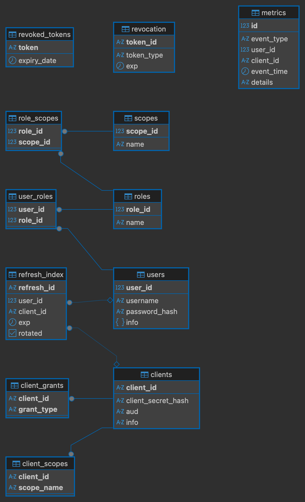

#  Oauth Server

### Описание проекта

Данный проект демонстрирует реализацию системы аутентификации и авторизации на базе Spring Boot и Spring Security OAuth2. Архитектура разделена на два логических модуля (или отдельных приложения):
1. **Auth Server (Сервер авторизации)** — отвечает за аутентификацию клиентов/пользователей и выдачу токенов.
2. **Resource Server (Сервер ресурсов)** — защищает API (`/api/payments`) и проверяет входящие токены.

### Примечание

Для тестового запуска необходимо запустить postgres на локальной машине на порту 5432. (либо исправить application.properties)
Запуск контейнера:

```bash
docker run --name oauth-postgre -e POSTGRES_PASSWORD=password -p 5432:5432 -d postgres
```

Инициализация хешей секретов и паролей происходит вручную в init.sql вместе с добавлением тестовых данных. Т.к. это тестовый проект с примером реализации, то будем считать такой метод допустимым. 

### Схема данных:

Таблицы создаются при запуске Spring Boot приложения по скрипту schema.sql 



## Архитектурные особенности и настройки

### 1. Подпись токенов (Симметричное шифрование HS256)
Для упрощения архитектуры используется симметричный алгоритм подписи **HS256**.
* Оба сервера (Auth и Resource) используют **один и тот же секретный ключ**, заданный в конфигурации: `auth.jwt-secret`.
* На стороне Resource Server настроен кастомный бин `JwtDecoder` с использованием `NimbusJwtDecoder.withSecretKey()`, так как стандартный механизм Spring ориентирован на асимметричный RS256 и поиск `issuer-uri`.

### 2. Хеширование секретов клиентов (BCrypt)
Секреты клиентов (`client_secret`) хранятся в базе данных `oauth.clients` исключительно в виде хешей **BCrypt**.
* При аутентификации используется метод `BCrypt.checkpw(rawSecret, storedHash)`.
* Из-за вызова (`BCrypt.gensalt()`), хеши для одного и того же пароля в базе будут отличаться, что является нормой безопасности.

### 3. Механизм отзыва токенов (Blacklist)
Для реализации логаута и досрочного отзыва токенов используется таблица `oauth.revoked_tokens`. Если токен находится в этой таблице, Resource Server отклонит его, даже если срок его жизни (`exp`) еще не истек.

## Примеры API запросов (cURL)

### 1. Получение токена (Auth Server)

Запрос токена по механизму `client_credentials` (используется для межсервисного взаимодействия):

```bash
curl -X POST http://localhost:8080/api/auth/token \
     -u "payments-web-app:secret1" \
     -d "grant_type=client_credentials" \
     -H "Content-Type: application/x-www-form-urlencoded"
```

Ответ:
```json
{
  "access_token": "eyJhbGciOiJIUzI1NiIsInR5cCI6IkpXVCJ9...",
  "token_type": "Bearer",
  "expires_in": 3600,
  "scope": "payments:read"
}
```

Запросы к Resource Server (/api/payments)

спешный GET-запрос (200 OK):
Требует наличия SCOPE_payments:read.

```bash
curl -X GET http://localhost:8081/api/payments \
     -H "Authorization: Bearer <ACCESS_TOKEN>"
```

```bash
curl -X POST http://localhost:8081/api/payments \
     -H "Authorization: Bearer <ТОКЕН_ТОЛЬКО_С_READ_SCOPE>"
```

```bash
curl -X GET http://localhost:8081/api/payments \
     -H "Authorization: Bearer <ПРОСРОЧЕННЫЙ_ИЛИ_БИТЫЙ_ТОКЕН>"
```

## Интеграционное тестирование

В проекте реализованы интеграционные тесты с использованием `MockMvc` и Spring Boot Test. Они покрывают полный цикл работы OAuth2:
* Генерация токенов (Auth Server).
* Проверка доступов по Scopes (`@PreAuthorize` в Resource Server).
* Валидация подписи JWT (HS256) и времени жизни токена (`exp`).
* Проверка логики "черного списка" (отозванных токенов).

Для запуска тестов используйте команду:
```bash
mvn test
```
 или
```bash
./gradlew test
```

### ! Примечание к тестам

Если при их запуске возникла ошибка с 401 Unauthorized, то проблема скорее всего в хешах в бд. 